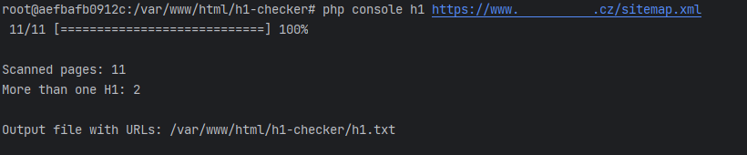

# Console Application for Finding URLs with Multiple H1 Headings
This is a console application written in PHP 8.2 using the Symfony Console component. The application takes a URL address with a sitemap.xml file as input and outputs the URLs where more than one top-level H1 heading is found.

## Installation

- Clone the repository or download the source code.
- Navigate to the project directory.
- Run the following command to install the dependencies using Composer:

    composer install  

## Usage  
To run the application, use the following command:

 
    php console h1 [sitemap]

Replace [sitemap] with the URL address of the sitemap.xml file you want to analyze.

## Example  

    php console h1 https://www.example.com/sitemap.xml  

## Description  
The application retrieves the sitemap.xml file from the provided URL and parses it to extract the URLs of individual pages. It then scans each page for H1 headings and identifies the URLs where more than one top-level H1 heading is found. The URLs with multiple H1 headings are saved to the "h1.txt" file.

During the scanning process, a progress bar is displayed to track the progress. Once the scan is complete, the application outputs the following information:

- Total scanned pages: [number]  
- URLs with more than one H1: [number]  
- Output file with URLs: [outputFile]  
- The application uses the Symfony Console component and ProgressBar class for a user-friendly command-line interface.

Note: The output file "h1.txt" is automatically created and overwritten each time the application is run.

## Requirements  
- PHP 8.0 or higher  
- Composer 

## License
This project is licensed under the MIT License.

## Credits  
This application was developed by Eduard Štůla.